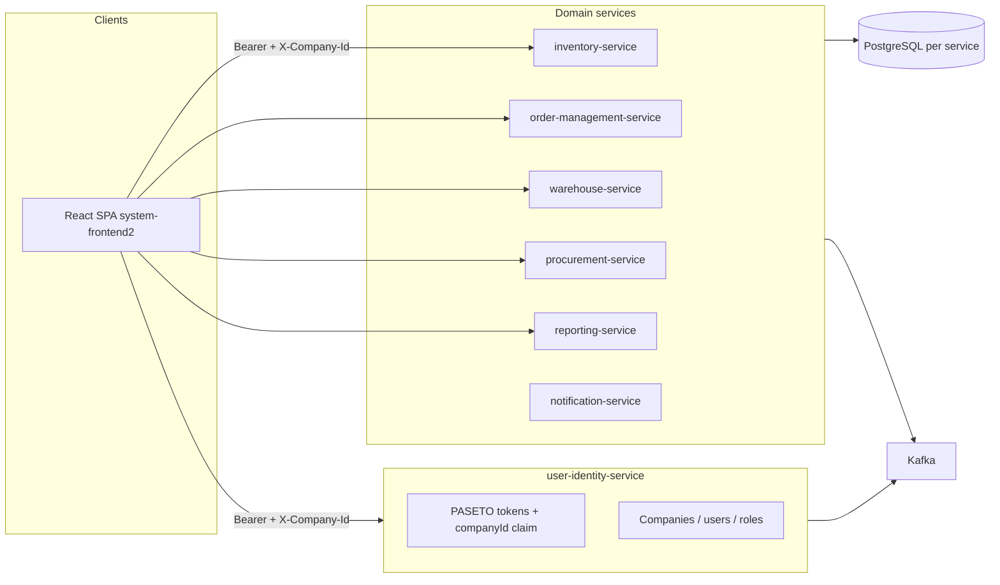

# Logistics Management System

Multi-service logistics platform with **company-scoped tenants**, **PASETO-based auth**, and a **React (Vite)** operations UI. Core flows cover identity, inventory, warehouses, orders, procurement, notifications, and reporting.

## Architecture (high level)



- **Tenant key**: `company_id` (UUID) on users and business data; APIs resolve effective tenant from the token and/or `X-Company-Id` (super-admins can switch company context in the UI).
- **Auth**: Shared **`logistics-security-common`** (PASETO parsing, tenant context, `PasetoAuthenticationFilter`). Services validate tokens and scope queries by company where applicable.
- **Async**: **Apache Kafka** for cross-service events.
- **Caching / locks**: **Redis** (e.g. identity sessions, order coordination).

## Backend services (ports)

| Service | Port | Responsibility |
|--------|------|------------------|
| user-identity-service | **8081** | Register/login, users, companies, roles (`SUPER_ADMIN`, `COMPANY_ADMIN`, …), PASETO |
| inventory-service | **8082** | Products, stock, batches; CSV/XLSX import (company-scoped) |
| warehouse-service | **8083** | Warehouses, locations, movements |
| order-management-service | **8084** | Orders, returns |
| procurement-service | **8085** | Suppliers, purchase orders, reorder hints |
| notification-service | **8086** | Notifications |
| reporting-service | **8087** | Aggregated reports |

Shared library: **`system-backend/logistics-security-common`**. Run `mvn install -pl logistics-security-common` from `system-backend` before individual services, or use **`scripts/start-dev-stack.ps1`**, which installs it before starting apps.

## Frontend

- **Primary app**: **`system-frontend2`** (Vite + React). Dev server: **http://localhost:5173** (or next free port).
- Sends **`Authorization: Bearer`** and **`X-Company-Id`** via `src/services/axiosInstance.js` (optional `VITE_*` base URLs).

## Local development

**Prerequisites**: JDK **21**, **Maven**, **Docker Desktop**, **Node.js**.

1. **Infrastructure**

   ```bash
   cd system-backend/infrastructure/docker
   docker compose up -d
   ```

2. **Backends + UI** (from this repo root)

   ```powershell
   powershell -ExecutionPolicy Bypass -File .\scripts\start-dev-stack.ps1
   ```

   Use **`-BackendsOnly`** to skip Vite, then `cd system-frontend2 && npm run dev`. Use **`-FrontendDir system-frontend2`** if needed.

Runtime logs: **`.dev-logs/`** (per service).

## Database migrations

Each service uses **Flyway** under `src/main/resources/db/migration`. If a migration fails, repair that database’s Flyway history before restarting (see `scripts/clear-failed-flyway-v7-identity.sql` for identity-only repair notes).

## Roles (identity)

- **`SUPER_ADMIN`**: platform-wide administration.
- **`COMPANY_ADMIN`**: company-scoped admin (one active per company, enforced in DB + services).
- **`WAREHOUSE_STAFF`**, **`VIEWER`**: operational / read access.

## Repository layout

```
logistics-management-system/
├── system-backend/              # Maven parent, logistics-security-common, services/*
├── system-frontend2/            # Main Vite React app
├── system-frontend/             # Alternate TS frontend (if used)
└── scripts/                     # start-dev-stack.ps1, helpers
```
